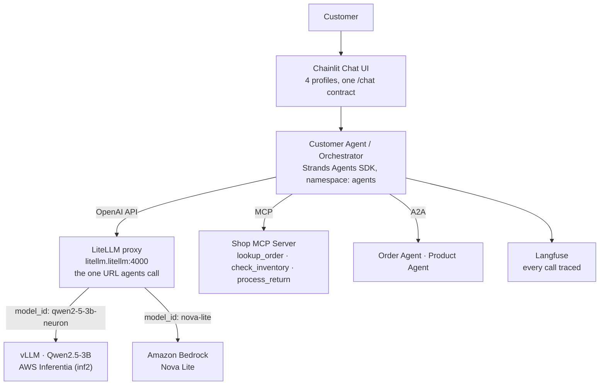

# Architecture

One customer service agent for AnyCompany Shop, two infrastructure tracks, and a model plane that makes switching between them a config change.

## The shared shape



The agent never knows which backend answered. That is the deliberate design, and it holds for every capability, not just the model.

## Self-managed track: everything on EKS

```
EKS Cluster (Auto Mode)
├── Inferentia Node Pool (scales from zero)
│   └── vLLM: Qwen2.5-3B on Neuron          :8000
├── litellm namespace
│   └── LiteLLM proxy (shared model plane)   :4000
├── General purpose nodes
│   ├── Customer Agent + A2A specialists     :8000 / :9000
│   ├── Shop MCP Server                      :8080
│   ├── Langfuse (observability)             :3000
│   ├── Milvus (RAG + semantic memory)       :19530
│   └── Neo4j (knowledge graph)              :7687
└── Chainlit UI                              :8080
```

Every layer is yours: model weights, vector store, traces, tools. Full control, full operational responsibility, cloud-portable.

## Integrated track: EKS orchestration + managed capabilities

```
EKS Cluster (Auto Mode)
├── agents namespace
│   └── Customer Agent (same image, same code)
│       │  MODEL_ID=nova-lite
│       ▼
├── litellm namespace
│   └── LiteLLM proxy ── Pod Identity ──▶ Amazon Bedrock
│
├── AgentCore Memory        session history (Pod Identity, no keys)
├── AgentCore Code Interpreter   sandboxed computation
├── AgentCore Browser            sandboxed web access
├── AgentCore Evaluations        managed LLM-as-a-Judge
└── langfuse namespace           unchanged from the self-managed track
```

What changed between the tracks is captured entirely in the diff between the two agent manifests (`deploy/k8s/customer-agent-*.yaml`): four environment variables. What did not change: the Strands agent code, the prompts, MCP, A2A, Langfuse, and the UI.

## Where each capability can live

| Capability | Self-managed choice | Integrated choice | Who absorbs the swap |
|---|---|---|---|
| Inference | vLLM + Qwen2.5-3B on Inferentia | Bedrock (Nova Lite) | LiteLLM (`MODEL_ID`) |
| Agent logic | Strands on EKS | Strands on EKS | Nobody; it never moves |
| Product knowledge | Milvus RAG | Milvus RAG | n/a |
| Conversation memory | Milvus semantic recall | AgentCore Memory | `MEMORY_BACKEND` |
| Business tools | MCP server on EKS | MCP server on EKS | n/a |
| Risky execution | (kept out of scope) | AgentCore Code Interpreter + Browser | `AGENTCORE_TOOLS` |
| Multi-agent | A2A protocol | A2A protocol | n/a |
| Tracing | Langfuse | Langfuse (+ dual export) | `AGENTCORE_OBSERVABILITY` |
| Evaluation | LLM-as-a-Judge via LiteLLM | AgentCore Evaluations | separate tooling |

## Identity model

- Users reach the UI; the agents are ClusterIP-only. (The workshop's reference diagrams put Cognito or Keycloak in front of the UI; that is the right production posture and is out of scope here.)
- The **LiteLLM** service account alone holds `bedrock:InvokeModel` via EKS Pod Identity. Agents cannot call models except through the plane.
- The **agent** service account holds AgentCore data-plane and trace-export permissions, and nothing about models.
- No static AWS credentials exist anywhere in the cluster.

## Design decisions worth stealing

1. **Put a proxy in front of inference on day one.** Backends then become routing entries, and "which model" stops being an architecture question.
2. **Observability before capabilities.** Langfuse lands before RAG, memory, or A2A, because from that point on every addition is debugged from traces rather than guesses.
3. **A 3B model plus good tools beats a big model without them** for a scoped task like customer service. Most of this agent's usefulness comes from `lookup_order`, RAG, and the graph.
4. **Vector search and graphs answer different questions.** Milvus finds what is similar; Neo4j walks what is related. The shop needs both.
5. **Emit rich traces even before you need them.** The evaluation lab showed grounding can only be scored if tool-call spans exist. What you can measure depends on what you emit.
